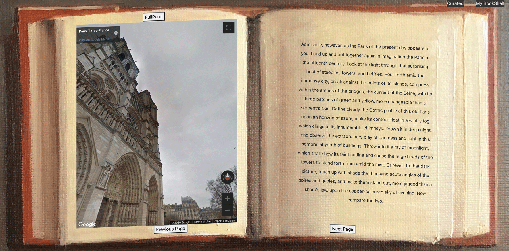
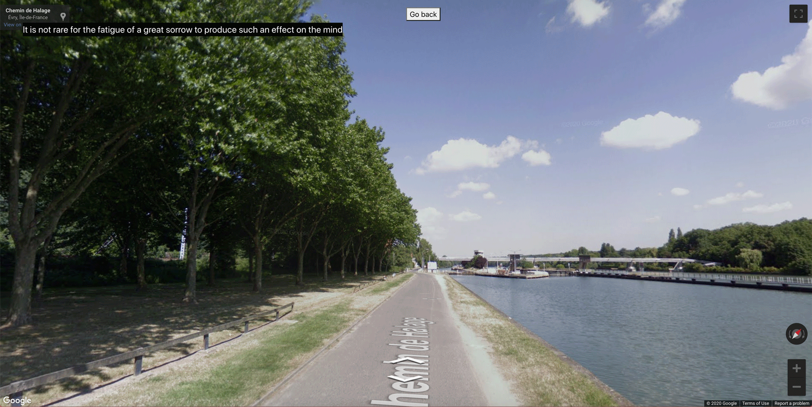

# Imaginary-Traveler


## Description
Imaginary Traveler provides a platform for users with a love of the written word and travel, on which they can virtually experience geographic locations significant to narratives or themes in a library of books and poems. 

When the user enters their login, they can browse an array of curated books represented on a bookshelf. Each book is a clickable portal that draws the audience into an interactive cinematic experience via specific plot points connected to Google maps.

The app also creates an innovative platform for literary talents to showcase their own interpretations or musings on familiar passages from books of their own selection.  By searching and adding a title to their personalized bookshelf, a user can link to a page where they add text and sync it with a google map street view of their choice as a saveable entry, thus building a unique library of journal entries on reading and travel. 

<hr/>

## Table of Contents
* [Installation](#Installation)
* [Technologies](#Technologies)
* [Demo](#Demo)
* [Links](#Links)
* [Potentiality](#Potentiality)
* [Developers](#Developers)

<hr/>

## Installation
```
npm i
npm run seed
npm start
```

<hr/>

## Technologies
* MERN Stack: a Javascript full-stack web application - which comprises of 4 technologies namely: MongoDB, Express, React and Node. js. 
* Front-End: React Library, React Animation: Typed.js, Javascript/ HTML5 Canvas, CSS Keyframes, Jesse’s Oil Painting, React-Google-Map-Street-View Api

<hr/>

## Demo

Click to watch user demo of curated contents:

<a href = "https://youtu.be/FT29ytRlrDk" target= "_blank">

</a>


Click to watch user demo of personal entries:

<a href = "https://youtu.be/2FZFCC6tM0o" target= "_blank">

</a>

<hr/>

## Links
* GitHub repository URL: https://github.com/tingtingctt/Imaginary-Traveler
* Heroku deployed URL: https://imaginarytraveler4.herokuapp.com

<hr/>

## Potentiality
* Seasonal updates on curated contents
* Improve UI to clarify how the user is meant to use this app
* Add other types of interactive media for educational purposes (art history, music history, film history, etc)
* Add more options for users to customize their personal entries (audios, images, videos, etc)
* Add ways to share entries with other users
* Add more interactive features to be integrated with Google Maps

<hr/>

## Developers

### Tingting Chen


* Email: tingtingctt@gmail.com
* GitHub Profile URL: https://github.com/tingtingctt


### Tristan Postley


* GitHub Profile URL: https://github.com/TristanPostley


### Jesse Aldana


* GitHub Profile URL: https://github.com/jessealdana


### Chris Rico


* GitHub Profile URL: https://github.com/chrisricola

<hr/>

### This app is dedicated to our instructor and TA's at UCLA Coding Bootcamp, without whose tireless debugging and continuous encouragement, we couldn't have grown into motivated web developers during the Covid-19 Pandemic of 2020.
```
Chad Tao
Bryan Swarthout
Wilson Lam
```
